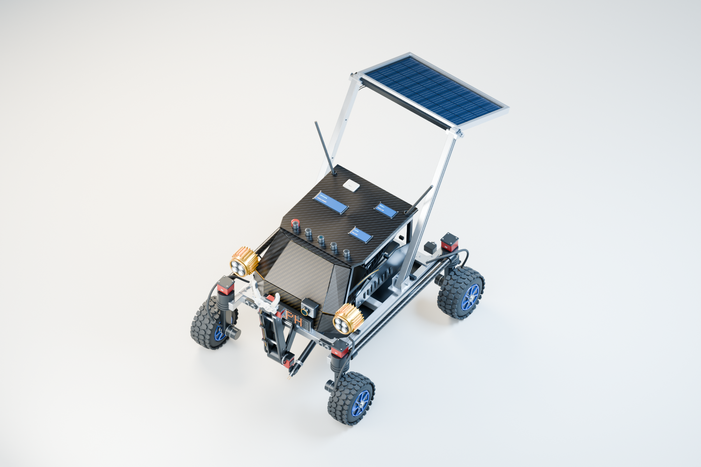

<div align="center">

# ZEPHYRON

**Solar-assisted mobility · Environmental reconnaissance · Distributed visual inference**

[](https://arxiv.org/abs/2609.25709)
[](https://github.com/Geneeex/zephyron/actions/workflows/verify.yml)
[](docs/REPRODUCIBILITY.md)
[](docs/LICENSING.md)
[](docs/LICENSING.md)

</div>

[Paper: arXiv:2609.25709](https://arxiv.org/abs/2609.25709) · [Reproduce the calculations](docs/REPRODUCIBILITY.md) · [Figure provenance](docs/FIGURE_PROVENANCE.md) · [Licensing](docs/LICENSING.md)

Supporting code, analytical data, editable models and manuscript sources for **Zephyron: Integrated Design and Analytical Evaluation of a Solar-Assisted Mobile Manipulator for Multimodal Environmental Reconnaissance and Distributed Visual Inference**.

<p align="center"></p>

*Editable Blender design illustration. This image is not evidence of a physical field trial.*

Zephyron combines four-wheel mobility, a front manipulator, environmental sensing, a raised rear solar module, local recording and distributed visual inference. This repository makes the selected design assumptions, calculations and proposed mission architecture inspectable.

The numerical results are **analytical scenarios**, and the machine-learning architectures are **proposed and untrained**. The test suite verifies software and mathematical consistency. There are no acquired rover test logs, measured endurance results, trained model weights or experimentally established payload ratings in this release.

## Start here

With Python 3.12, run the offline checks from this folder:

```sh
python scripts/verify_repository.py
```

The expected result is **45 software checks passed** and **16/16 CSV datasets reproduced byte for byte** on the recorded Windows environment. The report is written to `build/reports/verification_report.json`. See [test scope](docs/TESTING.md) for what each group establishes and the limits of cross-platform floating-point parity.

To regenerate all nine analytical figures as PNG and SVG:

```sh
python -m pip install -r requirements.txt
python scripts/verify_repository.py --figures
```

Generated results go into `build/`; committed source data and figures are preserved. The [reproduction guide](docs/REPRODUCIBILITY.md) explains virtual environments, custom scenarios, inputs and outputs.

## Repository contents

| Location | Contents |
|---|---|
| [`research/`](research/) | Analytical models, selected baseline, scenario definitions and runnable tests |
| [`research/analysis/`](research/analysis/) | 16 CSV tables, analytical summary and input provenance |
| [`research/figures/`](research/figures/) | Nine analytical figure pairs and captions |
| [`research/ml/`](research/ml/) | Frame freshness, bounding-box matching, metrics and grouped-split primitives; 33 fixtures |
| [`research/blender/`](research/blender/) | Native packed Blender file with nine scenes and nine rendered illustrations |
| [`research/canva/`](research/canva/) | 15 genuine Canva page renders, final text, authoring references and provenance |
| [`research/literature/`](research/literature/) | Search log, 4,858 bibliographic records, focused evidence and credited source figures |
| [`assets/photographs/`](assets/photographs/) | Three original author-supplied rover photographs |
| [`manuscript/`](manuscript/) | Editable Word manuscript, complete LaTeX project and text source |
| [`references/`](references/) | The 59-source bibliography and supporting reference metadata |
| [`docs/`](docs/) | Calculations, data dictionary, test scope, model instructions and publishing guide |
| [`verification/`](verification/) | Recorded local verification evidence for this prepared release |

## Paper and authors

The preprint was submitted to arXiv on **22 September 2026**, under Robotics (`cs.RO`). Use the [versioned record](https://arxiv.org/abs/2609.25709v1) when referring specifically to the first arXiv version. An arXiv preprint is not a journal acceptance claim.

1. **Sabik Bin Sultan** — Bangladesh Air Force Shaheen College Kurmitola — sabikbinsultan@gmail.com
2. **Shafi Bin Sultan** — St.Joseph Higher Secondary School — shafibinsultan0207@gmail.com
3. **Safwan Sadad** — Greenland Residential School — Avoidsafwan@gmail.com

The local editable manuscripts retain this author order. They are author-side supporting files; byte-for-byte identity with the arXiv source archive has not been established. See [manuscript notes](docs/MANUSCRIPT.md).

Use GitHub's **Cite this repository** entry or [`CITATION.bib`](CITATION.bib). The preferred citation points to the paper; the software supplement has not been assigned a separate DOI or release tag.

## Models and diagrams

Open `research/blender/Zephyron_Research_Missions.blend` in Blender 4.3.2 or a compatible version. It contains nine persistent scenes, with packed image textures. [Blender instructions](docs/BLENDER.md) describe the scene selector and optional rendering command.

The [Canva diagram master](https://www.canva.com/d/IDTTD9Ce011n5H1) contains editable diagrams with figure titles and arrow legends. Included images are genuine **596 × 335 pixel Canva previews**. Obtain high-resolution exports from the native design before a publication requires larger artwork. Local HTML layout sources are identified as authoring references, not Canva exports. See [Canva notes](research/canva/README.md).

## Evidence boundaries

- Dimensions, masses and performance claims from the earlier AI-written concept document were excluded. The present values are selected design assumptions informed by component envelopes and analysis.
- The broad search retrieved 5,000 metadata rows, reduced to 4,858 unique records. It does not mean 5,000 complete papers were read. The focused evidence ledger records 25 platform and sensing sources.
- Public metadata omits abstract text and raw API responses. Original screening flags are retained; reproducing every historical flag requires the original abstract inputs, which are not redistributed.
- Reused figures describe their original platforms and experiments. Their captions and source licenses remain attached in [third-party notices](THIRD_PARTY_NOTICES.md).
- The supplied code is research support, not deployed rover firmware, a trained perception system or a validated safety controller.

## Verification and contribution

Fresh [publication verification](verification/publication_checks.json) passed **45 software checks**, reproduced **16/16 CSV datasets byte for byte**, and regenerated **all nine analytical figure pairs** on Windows with Python 3.12. The [GitHub Actions workflow](https://github.com/Geneeex/zephyron/actions/workflows/verify.yml) verifies the file manifest and runs the same calculation and figure checks after each push or pull request. Historical preparation reports remain separately labelled.

See [CONTRIBUTING.md](CONTRIBUTING.md) for changes to assumptions, tests and future measured datasets. Keep calculated, simulated and experimentally measured evidence explicitly labelled.

## License and publishing

Original code is under the [MIT License](LICENSE), with copyright notice **Sabik Bin Sultan**. Original documentation and visuals are under **CC BY 4.0** as detailed in [the licensing guide](docs/LICENSING.md); the paper retains all three author credits. Third-party materials keep their original licenses.

This project is maintained at **[Geneeex/zephyron](https://github.com/Geneeex/zephyron)**. For future updates, follow [the GitHub publishing guide](docs/UPLOAD_TO_GITHUB.md). Use Git or GitHub Desktop for the complete repository because the Word manuscript exceeds GitHub's browser upload limit. No PDF files are included.
